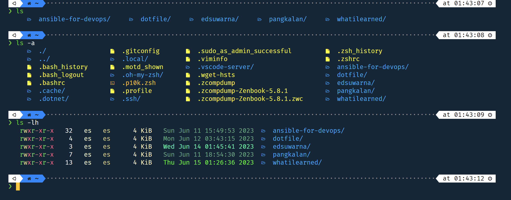

Colorls adalah Ruby gem yang mempercantik perintah ls di terminal dengan warna dan ikon font-awesome.
Info lebih lanjut tentang colorls https://github.com/athityakumar/colorls

Terminal saya menggunakan zsh, powerlevel10k sebagai tema dan Firacode NF sebagai font.

### Cara install colorls

Pertama, install ruby, gcc dan make menggunakan perintah ini:

`sudo apt install ruby-dev gcc make`

Setelah itu, install colorls dengan gem menggunakan perintah ini:

`sudo gem install colorls`

Jika instalasi berhasil, langkah selanjutnya adalah menambahkan alias ke file zshrc. Buka file .zshrc:

`vi .zshrc`

Tambahkan ini di baris paling bawah file zshrc:
```
if [ -x "$(command -v colorls)" ]; then
    alias ls="colorls"
    alias la="colorls -al"
fi
```

Simpan file dan reload zsh dengan perintah ini:

`source .zshrc`

Sekarang perintah ls kamu akan terlihat keren seperti ini:


