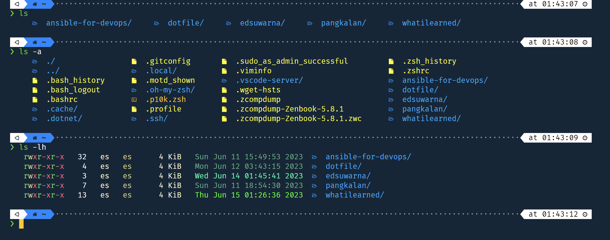

Colorls is a Ruby gem that beautifies the terminal's ls command, with color and font-awesome icon.
More about colorls https://github.com/athityakumar/colorls

My terminal use zsh, powerlevl10k for the theme and Firacode NF for the font.

### How to install colorls
first you need to install rubby, gcc and cmake using this command:

`sudo apt install ruby-dev gcc make`

After that you can install colorls with gem using this command:

`sudo gem install colorls`

If the installation is success, the next step is add alias to zshrc file. Open .zshrc file using this command:

`vi .zshrc`

Add this to the zshrc file on the botom line
```
if [ -x "$(command -v colorls)" ]; then
    alias ls="colorls"
    alias la="colorls -al"
fi
```
Save the file and reload zsh using this command:

`source .zshrc` 

Now your ls command will be beautiful like this


